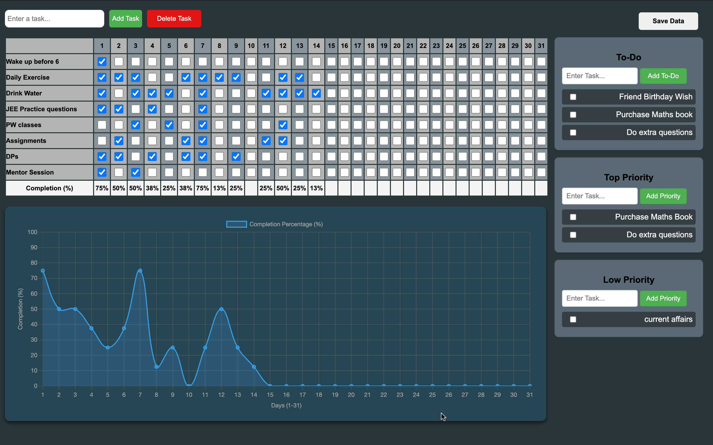

# TASK MANAGEMENT SYSTEM

## 🌐 Live Demo  

You can access and use the **TASK MANAGEMENT SYSTEM** directly by clicking the link below:  

👉 **[Use the Website Here](https://satyam-jaat.github.io/Task_Management/)**  

> Note: Make sure to use the same browser for login and task tracking since data is stored in local storage.
---

## **Features**
✔️ **Task Management** - Add, delete, and track tasks dynamically.  
✔️ **Interactive Schedule Table** - A 31-day calendar-style schedule to track progress.  
✔️ **Progress Chart** - Visualize task completion percentages using interactive graphs.  
✔️ **Priority Management** - Categorize tasks based on urgency and importance.  
✔️ **User-Friendly Interface** - Clean UI with seamless navigation and responsiveness.  

---

## **Technologies Used**
🔹 **HTML5** - For structuring the web pages.  
🔹 **CSS3** - For styling and UI enhancements.  
🔹 **JavaScript** - For interactivity and real-time task updates.  

---

## **Screenshots**

  

---
## How to Use ASK MANAGEMENT SYSTEM  
---
### 🔹 First-Time Setup  
- On the first visit, a **pop-up** will ask you to **set a username and password** (stored in local storage).  
- Use the **same browser** for future logins.  
---
### 🔹 Logging In  
- Enter your **username and password** to access your tasks.  
- **Data is stored locally**, so use the same browser where you signed up.  
---
### 🔹 Adding & Managing Tasks  
- Add tasks dynamically and assign **priority (High, Medium, Low)**.  
- Mark tasks as completed in the **schedule table**.  
- The **progress chart updates automatically**.  
---
### 🔹 Saving & Resetting Data  
- **Data is auto-saved** in local storage, no need for an internet connection.  
- Click the **Reset button (bottom-right corner)** at the **end of the month** to start fresh.  
---
### 🔹 Forgot Password?  
- Click **"Forgot Password?"** → Check the **"I am not a robot"** box.  
- Your **username and password** will be displayed.  
---
### ⚠️ Important Notes  
- **Use the same browser** where you registered.  
- **Data is not synced across devices** (local storage only).  
- Reset your tasks at the **end of each month** using the reset button.  
